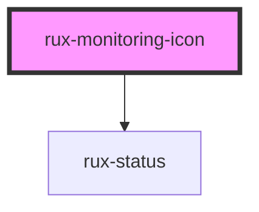

# rux-monitoring-icon

<!-- Auto Generated Below -->

## Properties

| Property        | Attribute       | Description | Type     | Default     |
| --------------- | --------------- | ----------- | -------- | ----------- |
| `icon`          | `icon`          |             | `string` | `''`        |
| `label`         | `label`         |             | `string` | `''`        |
| `library`       | `library`       |             | `string` | `undefined` |
| `notifications` | `notifications` |             | `number` | `0`         |
| `status`        | `status`        |             | `string` | `'normal'`  |
| `sublabel`      | `sublabel`      |             | `string` | `''`        |

## Dependencies

### Depends on

- [rux-status](../rux-status)

### Graph

----------------------------------------------

*Built with [StencilJS](https://stenciljs.com/)*
