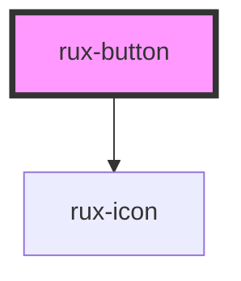

# Buttons

Buttons allow users to trigger actions.

## Guidelines

-   [Astro UXDS: Buttons](http://www.astrouxds.com/ui-components/buttons)

<!-- Auto Generated Below -->

## Usage

### Simple

```html
<rux-button></rux-button>
```

## Properties

| Property   | Attribute   | Description                                                                                                                                                                                                                                                                                                 | Type                 | Default     |
| ---------- | ----------- | ----------------------------------------------------------------------------------------------------------------------------------------------------------------------------------------------------------------------------------------------------------------------------------------------------------- | -------------------- | ----------- |
| `disabled` | `disabled`  | Toggles disabled attribute on the button                                                                                                                                                                                                                                                                    | `boolean`            | `false`     |
| `icon`     | `icon`      | For a [button styleguid, see the Button section in Astro UXDS Guidelines](https://astrouxds.com/components/button) Displays an Astro icon matching this string. For a [full list of available icons, see the Icons section in Astro UXDS Guidelines](https://astrouxds.com/ui-components/icons-and-symbols) | `string`             | `''`        |
| `iconOnly` | `icon-only` | Hides slotted text from the button by setting rux-button--icon-only class                                                                                                                                                                                                                                   | `boolean`            | `false`     |
| `outline`  | `outline`   | Changes button style from solid to outline by setting rux-button--outline class                                                                                                                                                                                                                             | `boolean`            | `false`     |
| `size`     | `size`      | Changes size of a button from standard to small or large by setting sizing classes                                                                                                                                                                                                                          | `"large" \| "small"` | `undefined` |

## Slots

| Slot        | Description |
| ----------- | ----------- |
| `"default"` | test        |

## Shadow Parts

| Part          | Description                  |
| ------------- | ---------------------------- |
| `"part-icon"` | the shadow part for the icon |

## CSS Custom Properties

| Name                                  | Description                           |
| ------------------------------------- | ------------------------------------- |
| `--buttonActiveBackgroundColor`       | Button active background color        |
| `--buttonActiveBorderColor`           | Button active border color            |
| `--buttonActiveControlTextColor`      | Button active text color              |
| `--buttonBackgroundColor`             | Button background color               |
| `--buttonBorderColor`                 | Button border color                   |
| `--buttonHoverBackgroundColor`        | Button hover background color         |
| `--buttonHoverBorderColor`            | Button hover border color             |
| `--buttonHoverTextColor`              | Button hover text color               |
| `--buttonOutlineBackgroundColor`      | Button outline background color       |
| `--buttonOutlineBorderColor`          | Button outline border color           |
| `--buttonOutlineHoverBackgroundColor` | Button outline hover background color |
| `--buttonOutlineHoverBorderColor`     | Button outline hover border color     |
| `--buttonOutlineHoverTextColor`       | Button outline hover text color       |
| `--buttonOutlineTextColor`            | Button outline text color             |
| `--buttonTextColor`                   | Button text color                     |

## Dependencies

### Depends on

-   [rux-icon](../rux-icon)

### Graph



---

_Built with [StencilJS](https://stenciljs.com/)_
