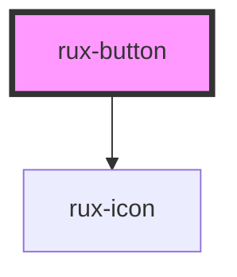

# Buttons

Buttons allow users to trigger actions.

## Guidelines

-   [Astro UXDS: Buttons](http://www.astrouxds.com/ui-components/buttons)

## Web Components Usage

## Basic HTML Usage

<!-- Auto Generated Below -->

## Usage

### Simple

```html
<rux-button></rux-button>
```

## Properties

| Property   | Attribute   | Description | Type                 | Default     |
| ---------- | ----------- | ----------- | -------------------- | ----------- |
| `disabled` | `disabled`  |             | `boolean`            | `false`     |
| `icon`     | `icon`      |             | `string`             | `''`        |
| `iconOnly` | `icon-only` |             | `boolean`            | `false`     |
| `outline`  | `outline`   |             | `boolean`            | `false`     |
| `size`     | `size`      |             | `"large" \| "small"` | `undefined` |

## CSS Custom Properties

| Name                                  | Description                           |
| ------------------------------------- | ------------------------------------- |
| `--buttonActiveBackgroundColor`       | Button active background color        |
| `--buttonActiveBorderColor`           | Button active border color            |
| `--buttonActiveControlTextColor`      | Button active text color              |
| `--buttonBackgroundColor`             | Button background color               |
| `--buttonBorderColor`                 | Button border color                   |
| `--buttonHoverBackgroundColor`        | Button hover background color         |
| `--buttonHoverBorderColor`            | Button hover border color             |
| `--buttonHoverTextColor`              | Button hover text color               |
| `--buttonOutlineBackgroundColor`      | Button outline background color       |
| `--buttonOutlineBorderColor`          | Button outline border color           |
| `--buttonOutlineHoverBackgroundColor` | Button outline hover background color |
| `--buttonOutlineHoverBorderColor`     | Button outline hover border color     |
| `--buttonOutlineHoverTextColor`       | Button outline hover text color       |
| `--buttonOutlineTextColor`            | Button outline text color             |
| `--buttonTextColor`                   | Button text color                     |

## Dependencies

### Depends on

-   [rux-icon](../rux-icon)

### Graph



---

_Built with [StencilJS](https://stenciljs.com/)_
