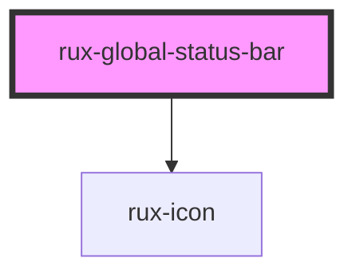

# Global Status Bar

The Global Status Bar is a full-width view across the top of an application — an area commonly reserved for global status, global command, and top-level navigation. The Global Status Bar often includes: Application Name, Application State, Monitoring Icons, Top Level Navigation, and an Emergency Button.

## Guidelines

-   [Astro UXDS: Global Status Bar](https://astrouxds.com/ui-components/global-status-bar)

## Web Components Usage

### 1. Installation

#### Install the Astro UXDS Global Status Bar package via Command Line (Preferred Method)

```sh
npm i -save @astrouxds/rux-global-status-bar
```

You may use Yarn, NPM, or your Node package manager of choice. The `--save` flag adds this component as a dependency in your `package.json` file.

#### **Alternatively**, download the [Astro UXDS Component Library](https://github.com/RocketCommunicationsInc/astro-components/src/master/) source to your project.

Via CLI:

```sh
git clone https://github.com/RocketCommunicationsInc/astro-components.git
```

Or, [download the Astro UXDS Components as a .zip](https://github.com/RocketCommunicationsInc/astro-components/archive/master.zip)

### 2. Import the Astro Global Status Bar Web Component

This example assumes you're using the NPM package in `node_modules`. Otherwise, import the component using the path to the Astro Components directory in your project.

```javascript
import { RuxGlobalStatusBar } from '@astrouxds/rux-global-status-bar/rux-global-status-bar.js'
```

### 3. Render the Astro Global Status Bar Web Component

Pass properties as attributes of the Astro Global Status custom element:

```xml
 <rux-global-status-bar includeIcon=true includeAppMeta=true appDomain="ABC" appName="Astro App" appVersion="3.0"></rux-global-status-bar>
```

#### Using Slots

The Global Status Bar component uses both named and unnamed slots. These slots correspond to the location the slotted element will appear within the Global Status Bar.

#### Named Slots

There are three named slots in the Global Status Bar: left-side, app-meta, and right-side. These can be used by declaring a slot attribute with the corresponding value on the element you want to be placed in that slot.

-   left-side (`<div slot="left-side" />`): places the content with the left-side slot attribute on the far left of the Global Status Bar. If the includeIcon prop is set to true, then the default component in the left-side slot is a `<rux-icon icon="apps" size="small">` which can be replaced by declaring a left-side slot in your markup. If you only want a different icon, you can declare a different icon property on the rux-icon using the menuIcon prop on Global Status Bar. If a menu-icon attribute value is provided that does not match an icon in the rux-icon libary, then no icon will be displayed.
-   app-meta (`<div slot="app-meta" />`): places the content with the app-meta slot attribute just to the right of the left-side slot, a common location for an application name and app state. This slot is in the middle of the Global Status Bar component, however its margin-right pushes it to the left. If the appDomain, appName or appVersion prop is set to a string value then the default elements in the app-meta slot are heading 1 elements showing the values for the appDomain, appName, and appVersion properties. If the includeAppState property is set to true then the app-meta slot also contains placeholder divs for an application state and username component. These default elements can be replaced by declaring an app-meta slot in your markup or the default app-meta information can be changed by setting the optional properties of appDomain, appName, and appVersion.
-   right-side (`<div slot="right-side" />`): places the content with the right-side slot attribute on the far right of the Global Status Bar. This slot has no default elements and will only display if a child element with the right-side slot attribute is included in your markup.

#### Unnamed Slots

There is one unnamed slot in the Global Status Bar. This slot is intended for any other elements or components you would like placed in the status bar separate from common components such as a menu icon and application name. Any child elements of the Global Status Bar that are not named slots will be considered slotted into this unnamed slot. Status bar elements like the [Clock](https://www.astrouxds.com/ui-components/clock), [Tabs](https://www.astrouxds.com/ui-components/tabs), [Buttons](https://www.astrouxds.com/ui-components/buttons), and even plain HTML can be inserted into the body of the Global Status Bar using the component’s [slot](https://developer.mozilla.org/en-US/docs/Web/HTML/Element/slot).

```xml
 <rux-global-status-bar class="dark-theme">
    <!-- Custom elements with named slot "left-side" rendered here or the rux-icon with default value rendered if the includeIcon property is set to true-->
    <!-- Custom elements with named slot "app-meta" rendered here or the default app-meta component with appDomain, appName, and appVersion props if the includeAppMeta property is set to true -->

    <!-- Unnamed slot elements rendered here -->
    <rux-clock></rux-clock>
    <div><!-- Any HTML here --></div>

	  <!-- Custom elements with named slot "right-side" are rendered here-->
 </rux-global-status-bar>
```

<!-- Auto Generated Below -->

## Properties

| Property          | Attribute           | Description                                                                         | Type      | Default     |
| ----------------- | ------------------- | ----------------------------------------------------------------------------------- | --------- | ----------- |
| `appDomain`       | `app-domain`        | Sets the domain of the application to be displayed in the default app-meta element  | `string`  | `undefined` |
| `appName`         | `app-name`          | Sets the name of the application to be displayed in the default app-meta element    | `string`  | `undefined` |
| `appVersion`      | `app-version`       | Sets the version of the application to be displayed in the default app-meta element | `string`  | `undefined` |
| `includeAppState` | `include-app-state` | Declares whether the app-state component will be shown in the app-meta slot         | `boolean` | `true`      |
| `includeIcon`     | `include-icon`      | Declares whether a rux-icon will be shown in the global status bar                  | `boolean` | `false`     |
| `menuIcon`        | `menu-icon`         | Sets the icon to be displayed in the default rux-icon component                     | `string`  | `"apps"`    |

## Dependencies

### Depends on

-   [rux-icon](../rux-icon)

### Graph



---

_Built with [StencilJS](https://stenciljs.com/)_
