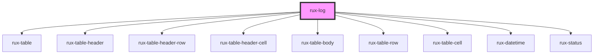

# rux-log

<!-- Auto Generated Below -->

## Properties

| Property   | Attribute  | Description | Type       | Default     |
| ---------- | ---------- | ----------- | ---------- | ----------- |
| `data`     | --         |             | `LogRow[]` | `undefined` |
| `timezone` | `timezone` |             | `string`   | `'UTC'`     |

## Dependencies

### Depends on

-   [rux-table](../rux-table)
-   [rux-table-header](../rux-table/rux-table-header)
-   [rux-table-header-row](../rux-table/rux-table-header-row)
-   [rux-table-header-cell](../rux-table/rux-table-header-cell)
-   [rux-table-body](../rux-table/rux-table-body)
-   [rux-table-row](../rux-table/rux-table-row)
-   [rux-table-cell](../rux-table/rux-table-cell)
-   [rux-datetime](../rux-datetime)
-   [rux-status](../rux-status)

### Graph

---

_Built with [StencilJS](https://stenciljs.com/)_
