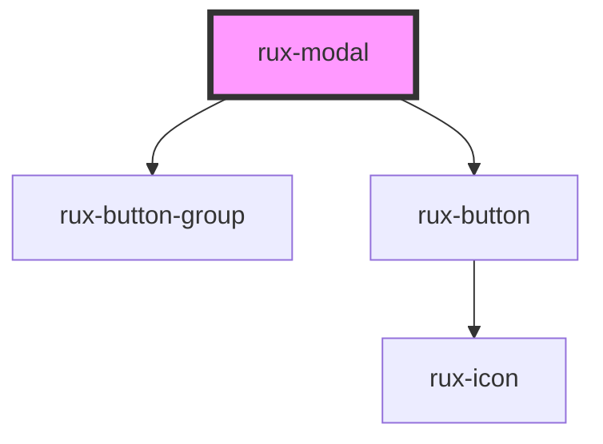

# rux-modal

<!-- Auto Generated Below -->

## Properties

| Property       | Attribute       | Description | Type      | Default     |
| -------------- | --------------- | ----------- | --------- | ----------- |
| `confirmText`  | `confirm-text`  |             | `string`  | `'Confirm'` |
| `denyText`     | `deny-text`     |             | `string`  | `'Cancel'`  |
| `modalMessage` | `modal-message` |             | `string`  | `''`        |
| `modalTitle`   | `modal-title`   |             | `string`  | `''`        |
| `open`         | `open`          |             | `boolean` | `false`     |

## Events

| Event         | Description | Type                   |
| ------------- | ----------- | ---------------------- |
| `modalClosed` |             | `CustomEvent<boolean>` |

## CSS Custom Properties

| Name                     | Description            |
| ------------------------ | ---------------------- |
| `--modalBackgroundColor` | Modal background color |
| `--modalBorderColor`     | Modal border color     |
| `--modalTextColor`       | Modal text color       |
| `--modalTitleColor`      | Modal title color      |

## Dependencies

### Depends on

- [rux-button-group](../rux-button-group)
- [rux-button](../rux-button)

### Graph

----------------------------------------------

*Built with [StencilJS](https://stenciljs.com/)*
