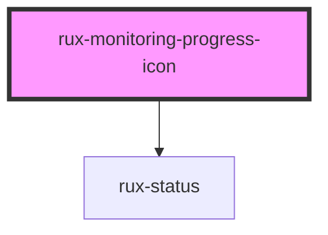

# rux-monitoring-progress-icon

<!-- Auto Generated Below -->

## Properties

| Property                | Attribute       | Description | Type          | Default     |
| ----------------------- | --------------- | ----------- | ------------- | ----------- |
| `label` _(required)_    | `label`         |             | `string`      | `undefined` |
| `max`                   | `max`           |             | `number`      | `100`       |
| `min`                   | `min`           |             | `number`      | `0`         |
| `notifications`         | `notifications` |             | `number`      | `0`         |
| `progress` _(required)_ | `progress`      |             | `number`      | `undefined` |
| `range`                 | --              |             | `RangeItem[]` | `undefined` |
| `sublabel`              | `sublabel`      |             | `string`      | `undefined` |

## Dependencies

### Depends on

- [rux-status](../rux-status)

### Graph

----------------------------------------------

*Built with [StencilJS](https://stenciljs.com/)*
