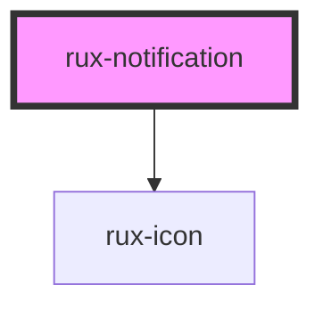

# rux-notification

<!-- Auto Generated Below -->

## Properties

| Property     | Attribute     | Description                                                                                                                                                                                                                                                                                                                                                                                                                                                                                      | Type      | Default     |
| ------------ | ------------- | ------------------------------------------------------------------------------------------------------------------------------------------------------------------------------------------------------------------------------------------------------------------------------------------------------------------------------------------------------------------------------------------------------------------------------------------------------------------------------------------------ | --------- | ----------- |
| `closeAfter` | `close-after` | If provided, the banner will automatically close after this amount of time. Accepts value either in milliseconds or seconds (which will be converted to milliseconds internally), between `2000` and `10000`, or `2` and `10`, respectively. Any number provided outside of the `2000`-`10000` range will be ignored in favor of the default 2000ms delay.  If `closeAfter` is not passed or if it is given an undefined or `null` value, the banner will stay open until the user closes it. | `number`  | `null`      |
| `message`    | `message`     | Message for the notification banner.                                                                                                                                                                                                                                                                                                                                                                                                                                                             | `string`  | `''`        |
| `open`       | `open`        | Set to true to display the Banner and begin countdown to close (if a close-after Number value is provided).                                                                                                                                                                                                                                                                                                                                                                                      | `boolean` | `false`     |
| `status`     | `status`      | Displays an icon from the [Astro UXDS Status System](https://astrouxds.com/patterns/status-system/) in the log entry's row. Possible values include 'off', 'standby', 'normal', 'caution', 'serious', and 'critical'                                                                                                                                                                                                                                                                             | `string`  | `'standby'` |

## Dependencies

### Depends on

- [rux-icon](../rux-icon)

### Graph

----------------------------------------------

*Built with [StencilJS](https://stenciljs.com/)*
