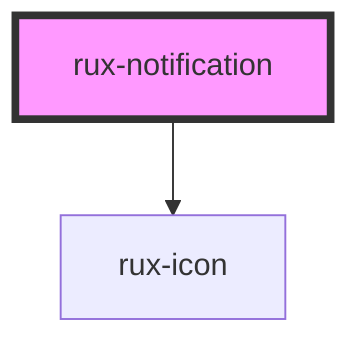

# rux-notification

<!-- Auto Generated Below -->

## Properties

| Property     | Attribute     | Description | Type      | Default     |
| ------------ | ------------- | ----------- | --------- | ----------- |
| `closeAfter` | `close-after` |             | `number`  | `null`      |
| `message`    | `message`     |             | `string`  | `''`        |
| `open`       | `open`        |             | `boolean` | `false`     |
| `status`     | `status`      |             | `string`  | `'standby'` |
| `target`     | `target`      |             | `string`  | `'local'`   |

## Dependencies

### Depends on

- [rux-icon](../rux-icon)

### Graph

----------------------------------------------

*Built with [StencilJS](https://stenciljs.com/)*
